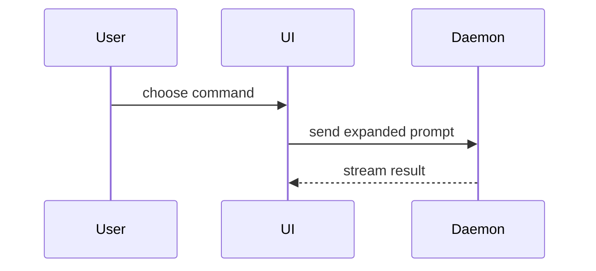

Write a PR body that explains the concrete problem, resulting behavior, observed validation, and material risk. This is a format reference: creating, pushing, or merging a PR follows the user's existing authorization and repository policy.

Read the repository PR template and applicable instructions first; fill their required fields instead of replacing them. Scale the body to the change. A small nonvisual fix usually needs one or two sentences plus validation, without a diagram or a risk taxonomy. For complex changes, use the following optional shape:

```markdown
## Summary

<concrete problem and resulting behavior; optional diagram, diff-sketch, or tree>

## Evidence

- **Before:** <screenshot/output/failing test run>
  **After:** <screenshot/output/passing test run>

## Merge Danger

**Door:** <one-way or two-way>

<optional: description>

**Affected scope:** <concrete affected users, surfaces, or data>

<optional: potential ramifications of merge>
```

## Sections

Skip preambles and keep prose brief. Use the user's configured domain authority; otherwise use existing `GLOSSARY.md` or legacy `CONTEXT.md`. Do not invent a second authority. If both glossary and legacy files exist without configuration and disagree, inspect repository routing and reconcile the ambiguity before selecting terms; preserve both and do not overwrite either.

## Codex remote and artifact delivery

Use the available Codex tools or a structured forge tool; no Claude Skill-tool call is required. With `gh`, write multiline bodies to a file and use `--body-file`. Keep reviewer-facing Markdown self-contained.

For substantial review packets or visual artifacts, use the `previews` skill, group related outputs into one session, and return its browser URL to the user. Use feedback only for an approval required by the task. If Previews is unavailable, state the limitation and provide accessible Markdown or artifact locators. Do not place private artifacts or inaccessible preview links in a public PR; attach only audience-appropriate evidence.

### Summary

Lead with the concrete change. Add the smallest visual only when it makes the key point clearer than prose.

- Show logic or an algorithm as pseudocode:

```text
on(save)
  if content is unchanged
    return cached result
  write new content
  return fresh result
```

- Show runtime control flow as a call tree:

```text
submitForm
  createSession
    persistPrompt
    launchAgent
  navigateToSession
```

- Show UI structure as a component tree, including state and module boundaries that matter:

```text
<SessionPage> (apps/example/src/routes/session.tsx)
  useSessionEvents()
  <SessionToolbar>
    <RunSkillButton> (packages/ui)
```

- Show file responsibility or a broad refactor as a shallow file tree:

```text
src/
├── commands/       # parses user actions
├── sessions/       # owns session state
└── transport/      # sends API requests
```

- Show component interaction, control flow, or data flow with Mermaid:



- Use `diff` when the point is what changes and the surrounding shape already exists. Match the diff shape to the topic.

For a component change:

```diff
 <SessionPage>
   useSessionEvents()
   <SessionToolbar>
+    <RunSkillButton />
   <SessionTimeline>
+    <SkillResultCard />
```

For a file-layout change:

```diff
 src/
 ├── commands/
+│   └── show-me.ts       # expands the slash command
 ├── sessions/
-└── transport.ts
+└── transport/
+    ├── client.ts
+    └── stream.ts
```

For a call-tree or call-stack change:

```diff
 submitForm
   createSession
     persistPrompt
+    expandSkillMention
     launchAgent
-  navigateToSession
+  navigateToSession
+    subscribeToEvents
```

For a state or control-flow change:

```diff
 on(save)
-  write content
+  if content is unchanged
+    return cached result
+  write new content
+  invalidate cache
```

- Show the whole block when most of it is new, when omitted context would hide ownership or order, or when the user needs a copyable target shape:

```ts
function expandSkill(command: string): string {
  const skillName = command.slice(1);
  return `use the ${skillName} skill`;
}
```

#### Guidance

Place each visual next to the short text it supports. Keep only the calls, files, props, states, and boundaries needed to answer the user's current question or the options to resolve the current discussion point.

You may use one of these, you may use several, it is unlikely you will use all of them. Use your judgement and don't overwhelm the user.

### Evidence

Use evidence actually observed: exact check commands and outcomes, relevant output, or screenshots. State skipped checks and limitations. Show before and after when captured; do not fabricate a failing baseline or claim execution from pseudocode. A passing targeted check can be enough for a small change.

For visual changes, screenshots or browser artifacts can demonstrate the affected behavior when the environment supports capture.

For nonvisual changes, prefer relevant execution results. Pseudocode explains behavior but is not execution evidence.

### Merge Danger

Include this section when reversibility or impact needs explanation, or the repository template requires it. Describe whether it's a one-way or two-way door. You can walk back through two-way doors, but not one-way doors. A PR that is cheap to roll back is lower risk. Changes that involve destructive actions or hard-to-reverse decisions are one-way doors.

The blast radius is the potential impact or scope of the changes introduced by this PR. Consider all possibilities. Examples are layout shift, breakages for consumers, mobile responsiveness, etc.
